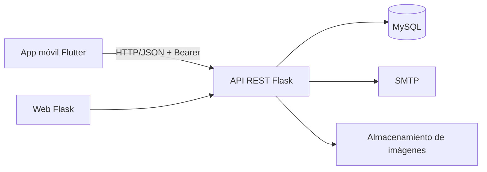

# Arquitectura del sistema

## Vista general

### Responsabilidades

- **Flutter:** interfaz, navegación, estado visual y carrito local persistente.
- **Flask:** autenticación, autorización, validaciones, reglas de negocio y API REST.
- **MySQL:** persistencia de usuarios, productos, pedidos, facturas, pagos y verificaciones.
- **SMTP:** verificación de correo y envío del comprobante PDF.
- **Almacenamiento:** imágenes de productos y comprobantes fuera de la base de datos.

## Decisiones de diseño

1. El precio definitivo y el stock siempre los determina el backend.
2. La creación del pedido y el descuento de stock usan una transacción.
3. Los productos se bloquean con `FOR UPDATE` durante el checkout.
4. Las conexiones MySQL se reutilizan mediante un pool configurable.
5. El carrito se persiste localmente por usuario, pero nunca se considera fuente de verdad de inventario o precios.
6. Los pagos solo pueden pasar de `en_revision` a una decisión final, evitando confirmaciones duplicadas.
